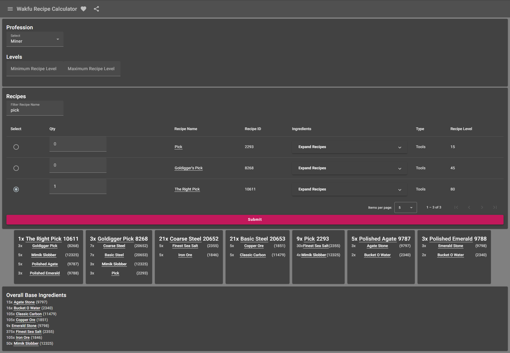

# Wakfu Recipe Calculator

Built in Angular

Basic Functionality to Calculate the Amount of Resources needed for Recipe Crafts

i.e. If you need to craft ItemA. Which also has a craftable recipe ItemB used in it. Then we will get the base resources needed for itemA plus all children base level resources of itemB and so on.

To do this, we built a WebScraper separately from this Repo to get the Recipes off Wakfu's Website

Then we stored the Recipes jsons we acquired into an API to call these json files

[ProfessionsAPI Sample](https://express.noredlace.com/api/wakfu/professions)

[ChefRecipesAPI Sample](https://express.noredlace.com/api/wakfu/profession/chef)

See the Scraper at [Github Repo](https://github.com/noredlace/wakfu-recipe-scraper)

## Docker
[Docker Repo](https://hub.docker.com/repository/docker/noredlace/wakfu-recipe-calculator)

Command from Unraid: 

`docker run -d --name='wakfu-recipe-calculator' --net='bridge' -e TZ="America/Chicago" -e HOST_OS="Unraid" -p '9898:80/tcp' 'noredlace/wakfu-recipe-calculator'`

## Sample Site Preview

